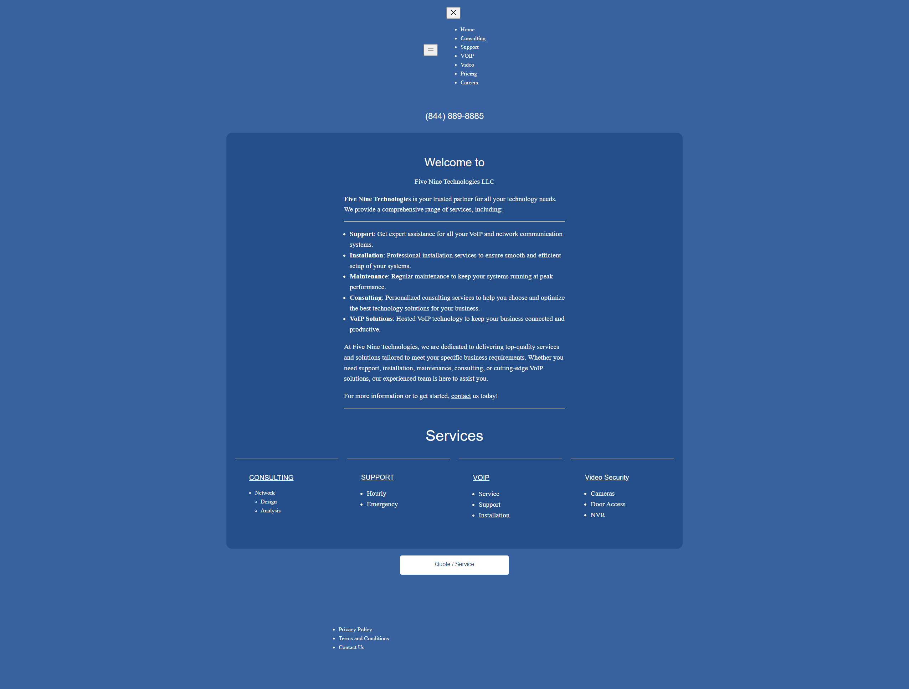
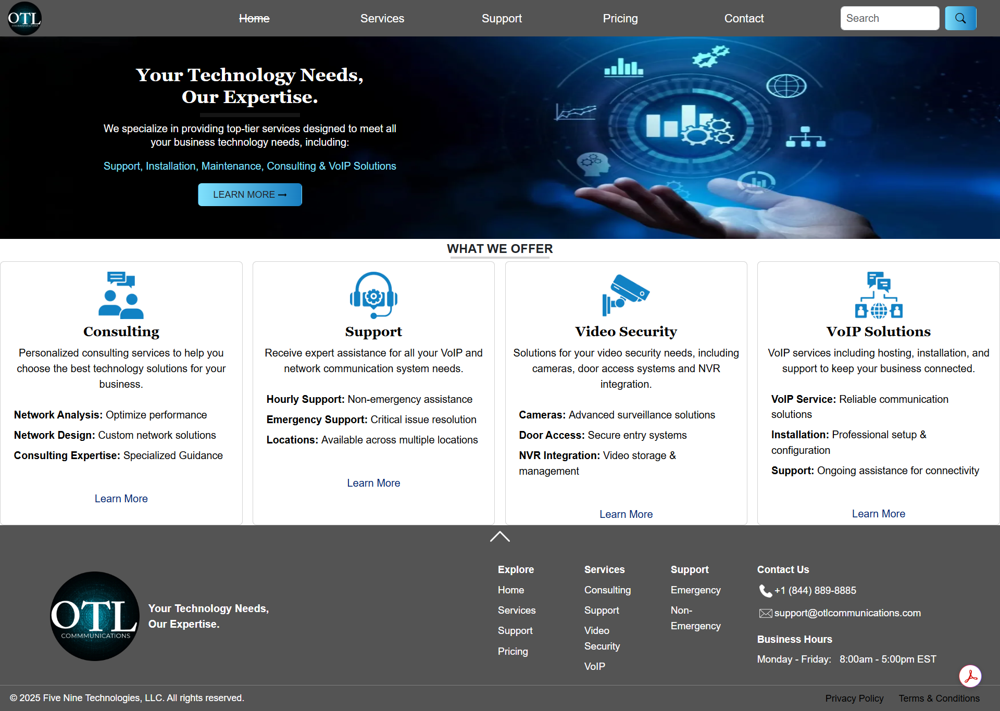
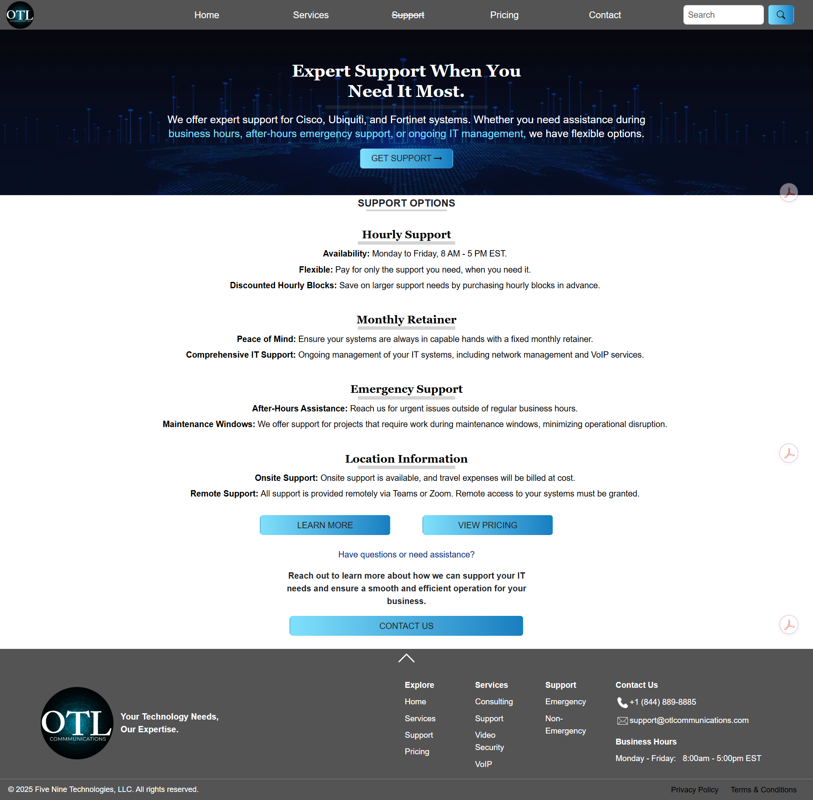
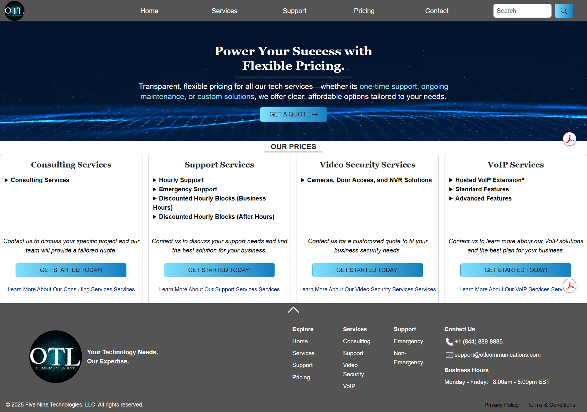
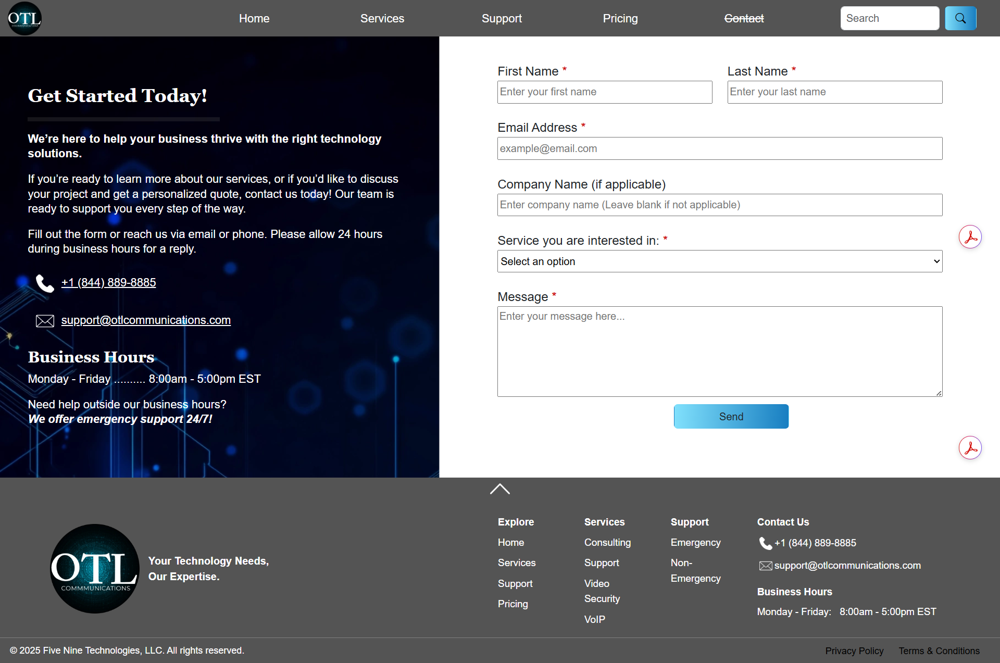

# OTL On The Line Communications

### Business Website & Digital Presence Platform

OTL On The Line Communications is a business website and digital presence platform developed to improve company presentation, customer communication, and overall site organization.

The project demonstrates client collaboration, information architecture, frontend web development, responsive design, and third-party service integration.

The original website contained fragmented content, inconsistent navigation, and limited clarity. My work focused on reorganizing the site structure, improving navigation, creating a clearer user experience, and implementing a more functional customer contact workflow. The live website has since received additional design updates by others.

---

## Project Overview

This project focused on transforming an existing business website into a more organized and user-friendly platform.

Primary objectives included:

- Reorganizing website content into a logical navigation structure
- Improving information flow and page hierarchy
- Presenting company services in a clearer format
- Creating a customer contact workflow using EmailJS
- Supporting search visibility through route-specific metadata

---

## Key Features

### Information Architecture

- Reorganized page structure and navigation
- Improved content organization and readability
- Structured business information for easier customer access

### Customer Communication

- Contact form integration using EmailJS
- Streamlined customer inquiry workflow
- Accessible contact path for prospective customers

### User Experience

- Responsive layouts for desktop, tablet, and mobile users
- Reusable Vue.js components
- Consistent navigation and page structure

### SEO Implementation

- Route-specific metadata
- Open Graph support
- Search engine-friendly page organization

---

## Technical Implementation

The website was built as a Vue.js single-page application using reusable components, client-side routing, Bootstrap styling, and EmailJS integration.

My contributions included:

- Reorganized website structure and information architecture
- Designed and implemented reusable Vue.js components
- Developed responsive layouts using Vue.js and Bootstrap
- Integrated EmailJS for customer contact functionality
- Configured route-specific SEO metadata
- Structured client-side routing using Vue Router
- Improved usability through simplified navigation and page organization

---

## Technology Stack

| Category | Technologies |
|-----------|-------------|
| Frontend | Vue.js, JavaScript, HTML5, CSS3 |
| UI Framework | Bootstrap 5 |
| Routing | Vue Router |
| SEO | Vue Meta |
| Third-Party Services | EmailJS |
| Tools | Git, GitHub, VS Code |

---

## Screenshots

The following screenshots demonstrate the primary user experience throughout the website.

### Original Website

Original website before restructuring and navigation improvements.

---

### Home Page

Introduces the company, primary navigation, and featured services.

---

### Services

Organized service offerings with improved content hierarchy and readability.

---

### Support

Dedicated support page providing customers with accessible assistance and service information.

---

### Pricing

Structured pricing information designed to improve transparency and customer decision-making.

---

### Contact

Integrated EmailJS contact form providing a streamlined customer communication workflow.

---

## Project Notes

This project represents an early freelance engagement completed while building experience in frontend development, client collaboration, and business-focused website organization.

The live website has since received additional visual design updates by others. This repository reflects my original contributions, including restructuring the site organization, improving navigation, implementing responsive layouts, configuring metadata, and integrating customer communication features.

---

## Author

**Jennifer Curtis**

Business Systems Analyst | Full-Stack Developer

🌐 **Portfolio:** [jennifercurtis.me](https://jennifercurtis.me)

💼 **LinkedIn:** [linkedin.com/in/jcurtisdeveloper](https://linkedin.com/in/jcurtisdeveloper)

💻 **GitHub:** [github.com/craftycurtis05](https://github.com/craftycurtis05)
